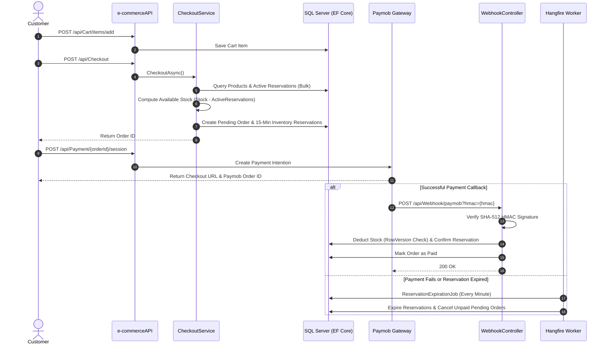

# E-Commerce RESTful API (.NET 8)

A secure E-Commerce RESTful API built with **.NET 8** and **Clean Architecture**, covering authentication, product catalog, shopping cart, checkout, inventory reservations, order management, Paymob payment integration, background processing, caching, and API security.

This repository demonstrates practical solutions to real-world backend engineering challenges, including **mitigating overselling during concurrent checkout**, **validating payment webhooks using SHA-512 HMAC signatures**, **automating background job cleanup with Hangfire**, and **implementing resilient caching with memory fallback**.

---

## 🏗️ Architecture & Project Structure

The solution follows **Clean Architecture** principles with strict dependency separation across four projects:

```text
e-commerceAPISolution/
├── e-commerceAPI/             # Presentation Layer: Controllers, Middlewares, Rate Limiter Policies, Program.cs
├── Ecom.Application/          # Application Layer: Services, DTOs, Application Interfaces, FluentValidation
├── Ecom.Infrastructure/       # Infrastructure Layer: EF Core AppDbContext, Repositories, Redis, Paymob, Hangfire
└── Ecom.Domain/               # Domain Layer: Core Entities, Value Objects, Domain Exceptions, Enums
```

### Layer Responsibilities
* **`Ecom.Domain`**: Contains core business entities (`Order`, `Product`, `InventoryReservation`, `Payment`, `Cart`), value objects (`Money`, `ShippingAddress`), domain exceptions, and enums. Has zero external dependencies.
* **`Ecom.Application`**: Encapsulates application use cases, DTOs, service interfaces, and request validation logic via FluentValidation.
* **`Ecom.Infrastructure`**: Handles persistence via **EF Core**, implements the **Repository Pattern** and **Unit of Work (`IUnitOfWork`)**, and integrates **Redis**, **Paymob**, and **Hangfire** background jobs.
* **`e-commerceAPI`**: Manages HTTP routing, controller endpoints, JWT authentication, sliding-window rate limiting, global exception handling, and request logging.

---

## 🌟 Key Features

### 🛒 Inventory & Concurrency
* **15-Minute Inventory Reservations**: Initiating checkout creates active temporary stock reservations (`InventoryReservation`) tied to order line items.
* **Dynamic Check-Time Stock Calculation**: Available stock is evaluated dynamically during checkout ($\text{AvailableStock} = \text{Product.StockQuantity} - \text{ActiveReservedQuantity}$) using bulk queries to avoid N+1 database queries.
* **Optimistic Concurrency Control**: Products use EF Core `RowVersion` to detect concurrent stock updates during payment confirmation. Concurrency conflicts are handled by flagging the order for refund processing and notifying an administrator via email.

### 💳 Payment & Webhook Security
* **Paymob Payment Integration**: Integrates with Paymob API for payment intention creation, billing payload generation, and checkout URL redirection.
* **SHA-512 HMAC Webhook Validation**: Recalculates and verifies SHA-512 HMAC signatures on all incoming Paymob webhook callbacks before updating system state.
* **Idempotent Webhook Processing**: Checks payment status (`payment.Status != PaymentStatusEnum.Pending`) to safely ignore duplicate or retried payment notifications.

### ⏳ Automated Background Processing (Hangfire)
* **Reservation Expiration Job**: Periodically scans for expired active reservations, expires the reservation and cancels the unpaid order, making the previously reserved inventory available again.
* **Payment Expiration Job**: Periodically identifies pending payments exceeding the allowed payment window and marks them as failed.
* **Secured Dashboard**: Protects the `/hangfire` dashboard route using a custom authorization filter (`HangfireAuthorizationFilter`).

### ⚡ Resilient Distributed Caching
* **Product Catalog Caching**: Caches paged catalog listings and product details in **Redis**.
* **Automatic In-Memory Fallback**: If Redis becomes unavailable, the cache service falls back to ASP.NET Core `IMemoryCache`, allowing catalog requests to continue without relying on Redis.

### 🛡️ Security & Observability
* **Partitioned Rate Limiting**: Uses ASP.NET Core 8 `PartitionedRateLimiter` with sliding windows partitioned by User ID (`sub` claim) or IP address across global, login, register, and password reset endpoints.
* **JWT & Refresh Tokens**: Manages user authentication via JWT access tokens and database-stored refresh tokens with revocation support (`logout-all`).
* **Sensitive Log Redaction**: Configures ASP.NET Core `HttpLogging` to remove `Authorization` and `Cookie` headers from application logs.
* **Standardized Error Responses**: Centralized exception middleware returns RFC 7807 `ProblemDetails` (`application/problem+json`) with trace identifiers.

---

## 🔄 Core Checkout & Payment Flow



---

## 🛠️ Technology Stack

| Category | Technology |
| :--- | :--- |
| **Framework** | .NET 8 (ASP.NET Core Web API) |
| **Database & ORM** | SQL Server, Entity Framework Core 8 |
| **Authentication** | JWT Bearer Tokens, Refresh Tokens, ASP.NET Core Identity |
| **Payment Gateway** | Paymob API (Intention Creation & HMAC Webhooks) |
| **Background Processing** | Hangfire (SQL Server Storage) |
| **Caching** | Redis (`StackExchange.Redis`), `IMemoryCache` (Fallback) |
| **Validation & Logging** | FluentValidation, Serilog, ASP.NET Core HttpLogging |
| **API Defense** | ASP.NET Core 8 RateLimiter (Sliding Window, User/IP Partitioned) |
| **Documentation** | Swagger / OpenAPI |

---

## 🚀 Getting Started

### Prerequisites
* [.NET 8 SDK](https://dotnet.microsoft.com/download/dotnet/8.0)
* [SQL Server](https://www.microsoft.com/en-us/sql-server/sql-server-downloads) (LocalDB or Full Server)
* [Redis Server](https://redis.io/) (Optional; falls back to in-memory cache if unavailable)

### 1. Clone the Repository
```bash
git clone https://github.com/ahmedhasan11/ecom-paymob-api.git
cd ecom-paymob-api
```

### 2. Configuration Setup
Update `e-commerceAPI/appsettings.json` or use **.NET User Secrets** for local development to keep sensitive credentials secure:

```bash
dotnet user-secrets init --project e-commerceAPI
dotnet user-secrets set "Jwt:Secret" "YOUR_SUPER_SECRET_KEY_MIN_32_CHARACTERS" --project e-commerceAPI
dotnet user-secrets set "Paymob:SecretKey" "YOUR_PAYMOB_SECRET_KEY" --project e-commerceAPI
dotnet user-secrets set "Paymob:PublicKey" "YOUR_PAYMOB_PUBLIC_KEY" --project e-commerceAPI
dotnet user-secrets set "Paymob:HmacSecret" "YOUR_PAYMOB_HMAC_SECRET" --project e-commerceAPI
```


### 3. Database Migration & Initial Seed
Apply EF Core migrations to create the database schema and seed default roles and admin account:
```bash
dotnet ef database update --project Ecom.Infrastructure --startup-project e-commerceAPI
```

### 4. Run the API
```bash
dotnet run --project e-commerceAPI
```
Navigate to `https://localhost:7088/swagger` to inspect and test endpoints in Swagger UI.

---

## 📋 Verified API Endpoint Overview

| Method | Route | Description | Auth Requirement |
| :--- | :--- | :--- | :--- |
| **Account & Authentication** | | | |
| `POST` | `/api/Account/register` | Register a new user account | Anonymous (Rate Limited) |
| `POST` | `/api/Account/login` | Authenticate & receive JWT + Refresh Token | Anonymous (Rate Limited) |
| `POST` | `/api/Account/refresh` | Renew expired access token using refresh token | Anonymous |
| `POST` | `/api/Account/logout` | Revoke current refresh token session | Authenticated |
| `POST` | `/api/Account/logout-all` | Revoke all active sessions for current user | Authenticated |
| `POST` | `/api/Account/change-password` | Change current user password | Authenticated |
| `POST` | `/api/Account/forgot-password` | Request password reset email | Anonymous (Rate Limited) |
| `POST` | `/api/Account/reset-password` | Reset password using reset token | Anonymous |
| `GET` | `/api/Account/confirm-email` | Confirm user email address | Anonymous |
| **Product Catalog** | | | |
| `GET` | `/api/Products` | Get paginated products with filtering/sorting | Anonymous (Redis Cached) |
| `GET` | `/api/Products/{id}` | Get product details by ID | Anonymous (Redis Cached) |
| `POST` | `/api/Products` | Create a new product | Admin Only |
| `PATCH` | `/api/Products/{id}` | Update product details | Admin Only |
| `DELETE` | `/api/Products/{id}` | Soft-delete product | Admin Only |
| `PATCH` | `/api/Products/{id}/stock/increase` | Increase product stock quantity | Admin Only |
| `PATCH` | `/api/Products/{id}/stock/decrease` | Decrease product stock quantity | Admin Only |
| `PATCH` | `/api/Products/{id}/availability` | Toggle product availability flag | Admin Only |
| `PATCH` | `/api/Products/{id}/restore` | Restore soft-deleted product | Admin Only |
| **Shopping Cart** | | | |
| `GET` | `/api/Cart` | Get current user's shopping cart | Authenticated |
| `POST` | `/api/Cart/items/add` | Add item to cart | Authenticated |
| `PATCH` | `/api/Cart/items/{productId}` | Update item quantity in cart | Authenticated |
| `DELETE` | `/api/Cart/items/{productId}` | Remove item from cart | Authenticated |
| `DELETE` | `/api/Cart/items` | Clear all items from cart | Authenticated |
| **Checkout & Orders** | | | |
| `POST` | `/api/Checkout` | Initiate checkout, create order & 15-min stock reservations | Authenticated |
| `GET` | `/api/Order/my` | Get paginated order history for current user | Authenticated |
| `GET` | `/api/Order/{orderId}` | Get order details by ID | Authenticated |
| `PATCH` | `/api/Order/{orderId}/status` | Update order status | Admin Only |
| **Payments & Webhooks** | | | |
| `POST` | `/api/Payment/{orderId}/session` | Create Paymob payment session & payment key | Authenticated |
| `POST` | `/api/Webhook/paymob` | Handle Paymob payment webhooks | Anonymous (HMAC Verified) |
| **Background Processing** | | | |
| `GET` | `/hangfire` | Monitor Hangfire background jobs | Admin Authorization Filter |

---

## 📮 API Testing

The API endpoints can be explored and tested interactively through **Swagger UI** (`/swagger`). 

A public **Postman API documentation** is also available:
**[View Postman Documentation](https://documenter.getpostman.com/view/38748410/2sBYApyshA)**

